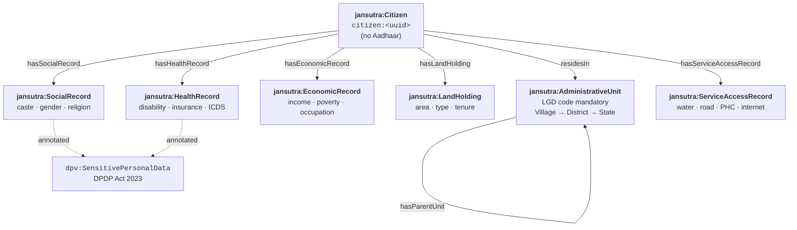

# Design

## Five principles

**No Aadhaar**
: Citizens are identified by opaque UUID URIs (`citizen:<uuid>`). No name, no Aadhaar number, no biometric reference is stored in the model. A linked profile of ST + BPL + disability + no-water is surveillance-capable if tied to a national identity number. UUID-based identification keeps that link outside Jansutra, in a mapping table that only the deployer controls.

**Federated modules**
: Each socioeconomic domain is a separate JSON-LD file. The Ministry of Health can share a health module without exposing land records. A state government can deploy only geography + economic without the social module. The ontology imposes a common vocabulary; it does not require a common data store.

**Privacy by design**
: All caste, religion, gender, and disability properties carry `dpv:SensitivePersonalData` annotations, derived from the Digital Personal Data Protection Act 2023. This makes legal obligations discoverable in the ontology itself — any system that reads the schema sees which properties trigger special handling.

**LGD-anchored geography**
: Every `jansutra:AdministrativeUnit` carries a mandatory MoPR Local Government Directory (LGD) code. LGD codes are India's stable canonical administrative identifiers — unlike census village codes, they do not change between decennial surveys. All administrative unit IRIs are built on LGD codes, so Jansutra data stays joinable across survey years.

**SHACL-enforced**
: Structural and taxonomic constraints are machine-checkable shape files. A data file that fails `python tools/validate.py` is not valid Jansutra data. This makes the model self-policing — bad data doesn't silently enter the graph.

---

## Architecture



All domain records (`SocialRecord`, `EconomicRecord`, etc.) are subclasses of `jansutra:VulnerabilityDimension`, which requires two provenance properties on every record:

- `jansutra:surveyYear` (`xsd:gYear`) — year the data was collected
- `jansutra:dataSource` (`xsd:string`) — originating survey or registry (e.g., `"SECC-2026"`, `"NFHS-6"`)

---

## Repository layout

```
ontology/
  context/jansutra.context.jsonld   ← shared prefix declarations (load this everywhere)
  core.jsonld                       ← jansutra:Citizen class + links to all domain records
  social.jsonld                     ← caste/gender/religion SKOS schemes
  economic.jsonld                   ← income, poverty status, occupation SKOS schemes
  geography.jsonld                  ← administrative hierarchy (State→District→Sub-district→Village)
  land.jsonld                       ← land holdings, tenure type, FRA titles
  health.jsonld                     ← disability (RPWD 2016), health insurance, children under 5
  services.jsonld                   ← access to water, electricity, PHC, school, road, internet

shapes/                             ← SHACL constraint files (Turtle), one per ontology module
examples/household-001.jsonld       ← annotated ST BPL female citizen in Jharkhand (PESA area)
sparql/                             ← reusable SPARQL queries for vulnerability analysis
tools/validate.py                   ← pyshacl runner
tools/query.py                      ← rdflib SPARQL runner with Rich table output
tools/convert.py                    ← JSON-LD → Turtle serializer
```

---

## Namespace conventions

| Prefix | Base IRI | Purpose |
|--------|----------|---------|
| `jansutra:` | `https://jansutra.in/vocab/` | All custom classes, properties, SKOS concepts |
| `citizen:` | `https://jansutra.in/citizen/` | Citizen instance URIs (`citizen:<uuid>`) |
| `geo:` | `https://jansutra.in/geo/` | Administrative unit instance URIs |
| `schema:` | `https://schema.org/` | `Person`, `Place` |
| `skos:` | `http://www.w3.org/2004/02/skos/core#` | Taxonomy classes and properties |
| `dpv:` | `https://w3id.org/dpv#` | DPDP Act 2023 privacy annotations |
| `prov:` | `http://www.w3.org/ns/prov#` | Data provenance |
| `gsp:` | `http://www.opengis.net/ont/geosparql#` | Geographic geometry |
| `owl:` / `rdfs:` / `xsd:` | W3C standards | Class/property definitions, datatypes |

All prefix declarations are centralised in `ontology/context/jansutra.context.jsonld` and referenced by every module via `"@context": "../ontology/context/jansutra.context.jsonld"`.
