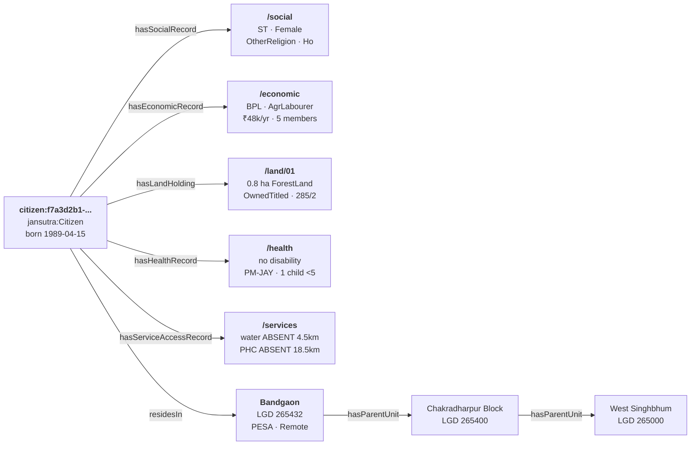

# Example Data

**File:** `examples/household-001.jsonld`

This annotated example represents a single citizen and her complete socioeconomic profile — the person the vulnerability query is designed to find.

---

## The citizen

Citizen `f7a3d2b1-4e89-4c56-a123-9b0c12de3f45` was born in April 1989. She lives in Bandgaon village, Chakradharpur Block, West Singhbhum district, Jharkhand.



---

## Social record

Survey source: `Census-2026-Caste-Enumeration`

- **Caste category:** Scheduled Tribe (`jansutra:ST`)
- **Gender:** Female
- **Religion:** Other Persuasion (`jansutra:OtherReligion`) — Census code 7; the Ho people practise Sarna
- **Mother tongue:** Ho (`xsd:language` BCP47 tag: `"ho"`) — a Munda language of the Austro-Asiatic family

---

## Economic record

Survey source: `SECC-2026`

- **Annual household income:** ₹48,000 (₹4,000/month for 5 members)
- **Monthly per-capita expenditure (MPCE):** ₹1,100 — below both the Tendulkar (₹1,407/month rural 2011-12 adjusted) and Rangarajan (₹1,524/month rural) poverty lines
- **Poverty status:** BPL
- **Occupation:** Agricultural Labourer (`jansutra:AgriculturalLabourer`) — wage labour on others' land
- **Household size:** 5
- **MGNREGA job card:** Yes — primary rural wage safety net

---

## Land holding

Survey source: `Jharkhand-Land-Registry-2026`

- **Area:** 0.8 hectares
- **Land type:** Forest Land (`jansutra:ForestLand`) — recognised under the Forest Rights Act 2006
- **Tenure:** Owned — Titled (`jansutra:OwnedTitled`) — registered title deed held
- **Khasra number:** 285/2 (cross-reference to Jharkhand Khatiyan revenue record)

This is an FRA individual forest rights title. The land is recognised, titled, and registered. Yet the household income is ₹48,000/year — a signal that the title has not been converted into agricultural credit, which is the most common barrier for FRA beneficiaries.

---

## Health record

Survey source: `NFHS-6`

- **Disability:** None
- **Health insurance:** Yes — PM-JAY (Ayushman Bharat) beneficiary
- **PMAY beneficiary:** Yes — Pradhan Mantri Awaas Yojana
- **Children under 5:** 1 — triggers ICDS Anganwadi Centre eligibility

---

## Service access record

Survey source: `DISHA-Dashboard-2026`

| Service | Type | Quality | Distance |
|---------|------|---------|---------|
| Water | `SafeWaterSource` | **Absent** | 4.5 km |
| Electricity | `GridElectricity` | **Intermittent** | — |
| Toilet | `HouseholdToilet` | Reliable | — |
| Road | `PavedRoad` | **Absent** | 12.0 km |
| PHC | `PHCAccess` | **Absent** | 18.5 km |
| Internet | `BroadbandInternet` | **Absent** | — |

---

## Vulnerability profile

!!! danger "Critical deprivation flags"
    This citizen matches the core use case from the blog post:

    | Gap | Scheme | Gap severity |
    |-----|--------|-------------|
    | No safe water (4.5 km) | Jal Jeevan Mission | Critical |
    | No PHC (18.5 km) | NHM PHC sub-centre | Critical — 85% above the 10 km norm |
    | No paved road (12 km) | PMGSY | Severe |
    | Electricity intermittent | SAUBHAGYA | Moderate |
    | No internet | BharatNet | Moderate |
    | FRA title but BPL income | NABARD credit-linkage | Structural gap |
    | Child under 5, AWC not surveyed | PM-POSHAN / ICDS | Unknown |

    The vulnerability SPARQL query surfaces this citizen in under 100ms given a populated district dataset.

---

## Full data file

```json
--8<-- "examples/household-001.jsonld"
```
